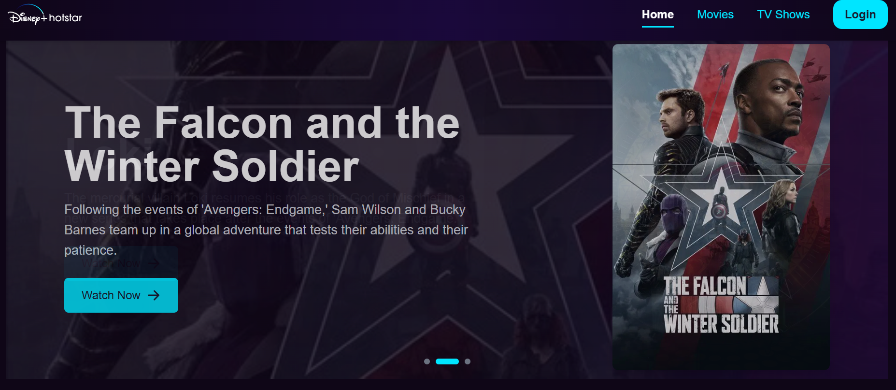
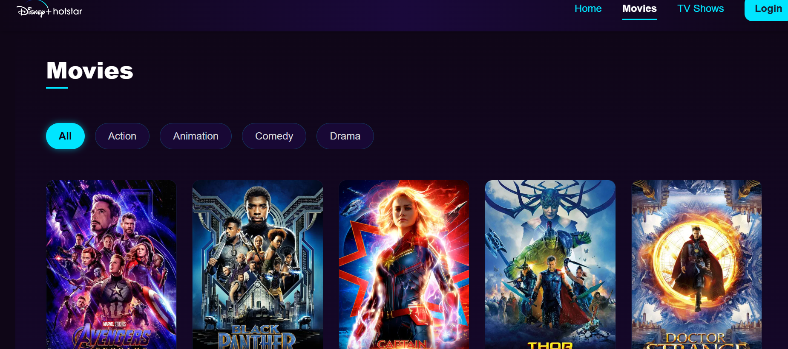
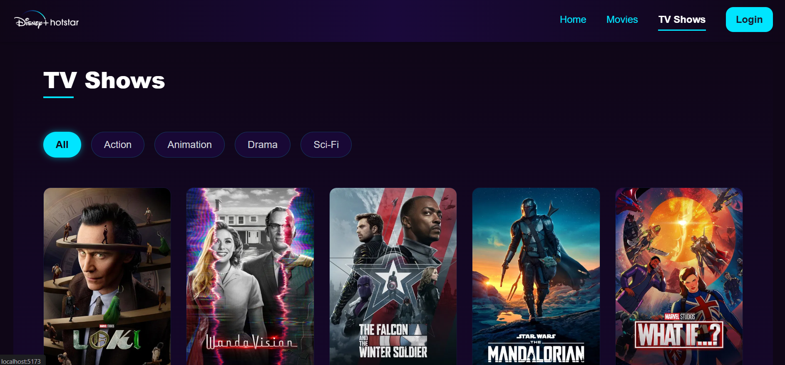
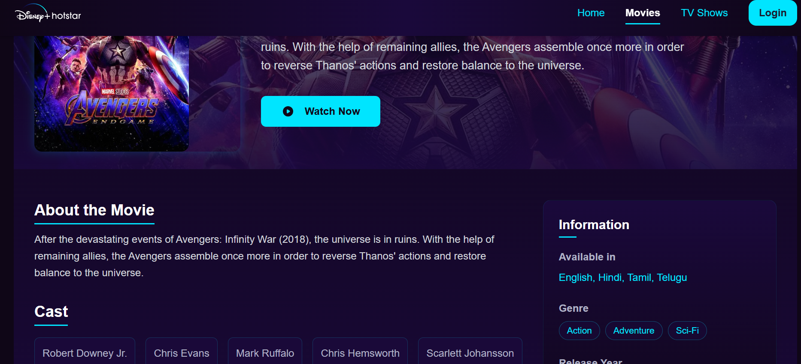
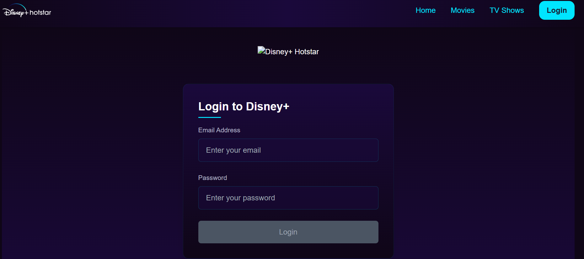

# Disney+ Hotstar Clone

A modern, responsive streaming platform clone built with **React**, **Vite**, and **Tailwind CSS**. This project replicates the Disney+ Hotstar experience with movie and show listings, authentication, and a sleek animated UI.

---

## 🚀 Features

- Responsive design for all devices
- Animated banners and interactive cards
- Movie and TV show listings with details
- User authentication (login)
- Dynamic routing with React Router
- Dark theme inspired by Disney+
- Modular, reusable components
- Easy to customize and extend

---

## 🖼️ Preview

| Home Page | Movies Page | TV Shows Page | Details Page | Login Page |
|-----------|-------------|------------|-------------|------------|
|  |  |  |  |  |

---

## 🛠️ Getting Started

### Prerequisites

- [Node.js](https://nodejs.org/) (v16 or higher recommended)
- [npm](https://www.npmjs.com/) or [yarn](https://yarnpkg.com/)

### Installation

1. **Clone the repository:**
   ```bash
   git clone https://github.com/kumarmanish562/disney_clone_frontend
.git
  
   ```

2. **Install dependencies:**
   ```bash
   npm install
   # or
   yarn install
   ```

3. **Start the development server:**
   ```bash
   npm run dev
   # or
   yarn dev
   ```

4. **Open your browser and visit:**
   ```
   http://localhost:5173
   ```

## 📁 Project Structure

```
disney_clone_frontend/
├── public/
├── src/
│   ├── assets/           # Images and static assets
│   ├── components/       # React components
│   ├── context/          # Context API for state management
│   ├── hooks/            # Custom hooks
│   ├── layouts/          # Layout components
│   ├── pages/            # Page components
│   ├── routes/           # Application routing
│   ├── utils/            # Utility functions
│   ├── App.jsx           # Main app component
│   └── main.jsx          # Entry point
├── package.json
└── README.md
```

---

## 📸 Screenshots

### Home Page


### Movies Page


### TV Shows Page


### Details Page


### Login Page


---

## 📦 Built With

- [React](https://react.dev/)
- [Vite](https://vitejs.dev/)
- [Tailwind CSS](https://tailwindcss.com/)
- [React Router](https://reactrouter.com/)
- [Axios](https://axios-http.com/)

---


## 📬 Contact

For any questions or feedback, please contact [mk8627121@gmail.com](mk8627121@gmail.com).